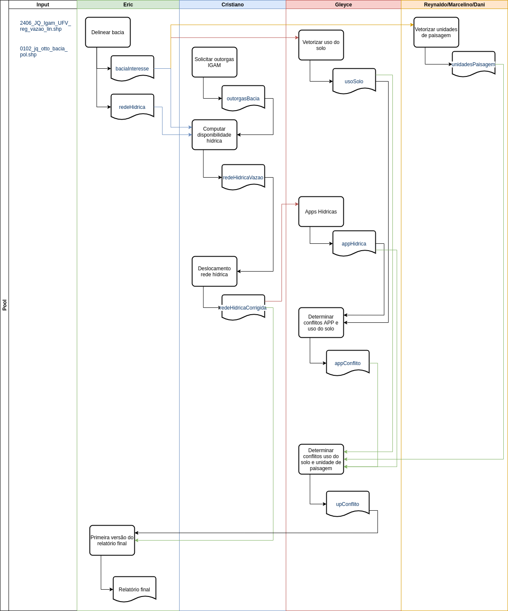

## NEPZAP/UFVJM

O Núcleo de Estudos e Pesquisa em Zoneamento Ambiental Produtivo foi criado em 2020 com a missão de contribuir para a uso sustentável dos recursos naturais. O NEPZAP/UFVJM atua principalmente nas regiões norte e vales do Jequitinhoha e Mucuri.

## Fluxograma

### Disponibilidade Hídrica

O objetivo dessa etapa é contabilizar em cada trecho dos cursos d’água da sub-bacia a demanda pelo uso da água regularizada e consequentemente a disponibilidade hídrica, detectando as situações de indisponibilidade (demanda acima do limite máximo de captação), estado de atenção (demanda acima de 50% do limite máximo de captação) e de disponibilidade (demanda abaixo de 50% do limite máximo de captação).

### Unidades de Paisagem

Essa etapa consiste na delimitação e caracterização das unidades de paisagem (UP) objetivando o planejamento do uso conservacionista dos recursos ambientais em bacias hidrográficas de pequeno porte. A definição das Unidades de Paisagem permite determinar as potencialidades, limitações e aptidões para usos e ocupações múltiplos. Parte-se do princípio de que o meio físico condiciona as diversas modalidades de usos e ocupações dentro dos paradigmas da sustentabilidade e das possibilidades de intervenções para prevenção, mitigação e correção de problemas ambientais, decorrentes da inobservância da capacidade de uso específica de cada unidade.

### Uso e Ocupação do Solo

O Uso e Ocupação do Solo é definido em função das normas relativas a densificação, regime de atividades, dispositivos de controle do parcelamento do solo. Uso do solo é o conjunto das atividades (processos individuais de produção e reprodução) de uma sociedade por sobre uma aglomeração urbana assentados sobre localizações individualizadas, combinadas com seus padrões ou tipos de assentamento, do ponto de vista da regulação espacial. Pode se dizer que o uso do solo é o rebatimento da reprodução social no plano do espaço urbano.

### Conflitos de uso da água e do solo

Este item intenciona correlacionar os resultados das três etapas do ZAP. Diversas informações podem ser obtidas, principalmente de acordo com as peculiaridades de cada área/região. Serão apresentadas aqui algumas possibilidades, no entanto, outras conclusões poderão ser levantadas.
